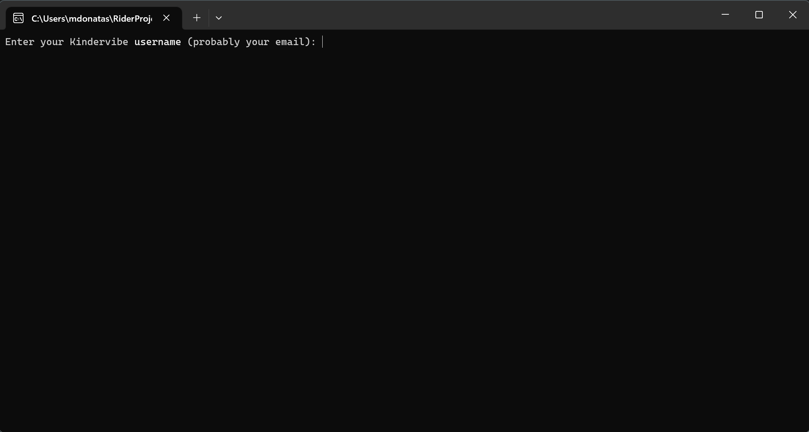

## Kindervibe Siurblys (Kindervibe Vacuum)
This is a simple command line tool for downloading photos from the Kindervibe app.

Since Kindervibe user experience is very poor when it comes to making photo backups it seemed that a tool such as this one would be beneficial at least to some users of it.

### Features
- Supports accounts with several children
- Makes a backup for a range of dates. E.g. `2023-01-01` - `2023-04-01`
- Photos from Kindervibe come without an EXIF dates, meaning there is no **Date** information on the photo file. Kindervibe Siurblys sets the correct date, albeit not the correct time as that information is not available
- Video files are also downloaded although no `Date` information is set on them
- Photo and Video files are placed in a `Kindervibe` directory created next to the app

### Demo
